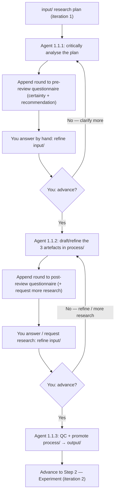

# Step 1 — Research

> Phase 1 (Research & Planning), Step 1.1. The first step in the khazad-dum pipeline.

## Purpose

You arrive at this step with a rough idea written up as a **research plan**. The Research step
pushes that idea until it is solid enough to act on. It does two things:

1. It **interrogates your plan** through two clarification gates — first to make sure it understands
   what you want, then to sharpen the outputs — asking you hard questions at each.
2. It produces three **handoff artefacts** for the next phases: a **literature review**, a **refined
   project plan**, and a set of **experiment recommendations**.

Everything downstream (the experiment, the architecture, the build) inherits the quality of what
comes out of here, so the step is deliberately sceptical: a fresh agent actively hunts for
ambiguities, gaps, unstated assumptions, and feasibility risks rather than nodding along.

## Where it sits in the pipeline

```
[you write a plan]  →  STEP 1 Research  →  Step 2 Experiment  →  Step 3 Architecture  → …
   iteration 1           ─────────────       iteration 2
```

Your initial plan is **iteration 1** of an evolving project plan. Research hands the refined plan
and experiment recommendations forward as the input to Step 2.

## The `input` / `process` / `output` convention

Every Phase-1 step has its own working directory — here `documentation/01_research/` — split into
three folders. This convention repeats in steps 1–4, so it is worth learning once:

| Folder     | Owner          | Holds                                                            |
|------------|----------------|-----------------------------------------------------------------|
| `input/`   | **You**        | The current plan iteration. The agent **never** writes here.    |
| `process/` | The agent      | Working files: the two questionnaires, and the draft artefacts. |
| `output/`  | The agent      | The finalised artefacts, promoted from `process/` on completion.|

The golden rule: **`input/` is yours.** The agent reads it but is forbidden from changing it. You
refine the plan by hand, in `input/`, between runs.

Note the flow of the three deliverables: they are **drafted and refined in `process/`** across the
second gate, and only **moved to `output/`** once you complete the step. The two questionnaires stay
in `process/` — they are working artefacts, not handoff.

## The workflow in detail

The step runs as three sub-prompts. A fresh agent (no memory of previous runs) is used each time;
the questionnaires and your edits to `input/` are the only memory between runs. Both gates are
**hybrid**: the agent reports how confident it is and recommends whether to advance, but **you make
the call** — there is no automatic threshold.

### Workflow 1.1.1 — Research Gate (Clarify the Plan)

A **looping pre-review gate**. Each run, the agent:

1. **Reads** your `input/` plan and the existing `process/pre-literature-review-questionnaire.md`
   (to see what was already asked and answered).
2. **Critically analyses** the plan — actively looking for problems, not confirming it understands.
3. **Appends a new round** of 3–12 questions to that single questionnaire (it never edits earlier
   rounds), headed with its **% certainty** and an *advance / clarify* recommendation.

You answer in-file, refine `input/`, and either re-run the gate or advance when you are satisfied.

### Workflow 1.1.2 — Literature Review & Post-Review Gate

A **looping post-review gate** that builds the deliverables. Each run, the agent:

1. **Creates or refines** the three artefacts in `process/`:
   - `literature-review.md` (3–4 pages). Every factual claim carries an Obsidian-style link plus
     two tags — **Certainty** (how sure the agent is the claim is correct) and **Reliability** (how
     trustworthy the source is) — each with a 🟩/🟨/🟧/🟥 band. Weighted toward what can actually be
     tested downstream on **AWS EC2 + a home-lab server**.
   - `refined-project-plan.md` — your plan synthesised with the review: tightened goal, explicit
     IN/OUT scope, success criteria, constraints, and decisions left open for the experiment.
   - `experiment-recommendations.md` — concrete things to test, each tied to a gap and mapped onto
     EC2 vs. home lab, concrete enough that Step 2 can turn them into a server config and payload.
2. **Appends a round** to the single `process/post-literature-review-questionnaire.md`, including an
   **Additional research requested** section — fill it to send the next cycle back for more research.

You answer, refine `input/`, and either re-run (to refine further or request more research) or
advance.

### Workflow 1.1.3 — Complete Research Step

A final quality pass that **promotes** the three artefacts from `process/` to `output/` (checking
every review claim is tagged, scope is unambiguous, and every recommendation maps to a real
resource). The questionnaires remain in `process/`. This is the handoff to Step 2.

## What you do

1. Write your initial plan into `documentation/01_research/input/` (seeded for you by
   `khazad-dum init`).
2. Run the research gate (`khazad-dum run research`, in the current CLI).
3. Read the questionnaire round in `process/`, **think, and answer it by editing your plan in
   `input/`**. Re-run the gate until you are happy, then advance.
4. The draft step writes the three artefacts to `process/` and a post-review questionnaire. Read,
   answer, request more research if needed, and re-run to refine — or advance.
5. Complete the step to promote the artefacts to `output/`.

> The questionnaires are meant to be demanding — they exist to force real thinking. Treat a long
> questionnaire as the step doing its job, not as a failure.

## Artifacts in and out

| Direction | File | Notes |
|-----------|------|-------|
| In  | `input/` research plan (iteration 1) | Human-owned. |
| Work | `process/pre-literature-review-questionnaire.md` | One file; a round appended per gate cycle. |
| Work | `process/post-literature-review-questionnaire.md` | One file; a round + an "additional research" section per cycle. |
| Work | `process/{literature-review,refined-project-plan,experiment-recommendations}.md` | Drafted and refined here. |
| Out | `output/literature-review.md` | Cited, 3–4 pages, EC2/home-lab weighted. |
| Out | `output/refined-project-plan.md` | Iteration 1 → refined. |
| Out | `output/experiment-recommendations.md` | Feeds Step 2. |

## Control flow



## Tips and gotchas

- **You are in control of the plan, and of advancing.** The agent advises and challenges; it never
  silently rewrites your `input/`, and it never auto-advances past a gate — you decide.
- **Keep experiment feasibility in mind.** Recommendations that need GPUs or managed cloud services
  are out of scope unless explicitly flagged — downstream you only have EC2 and a home lab.
- **A fresh agent each cycle** means the questionnaires and your written answers (in `input/`) are
  the only memory between runs. Answer in the plan itself, not in chat.
- **Use the "Additional research requested" section** in the post-review questionnaire whenever the
  literature review misses something — it is the supported way to ask for more.
- **The deliverables live in `process/` until you complete the step**, so you can iterate on them
  freely; nothing is treated as final until it lands in `output/`.
