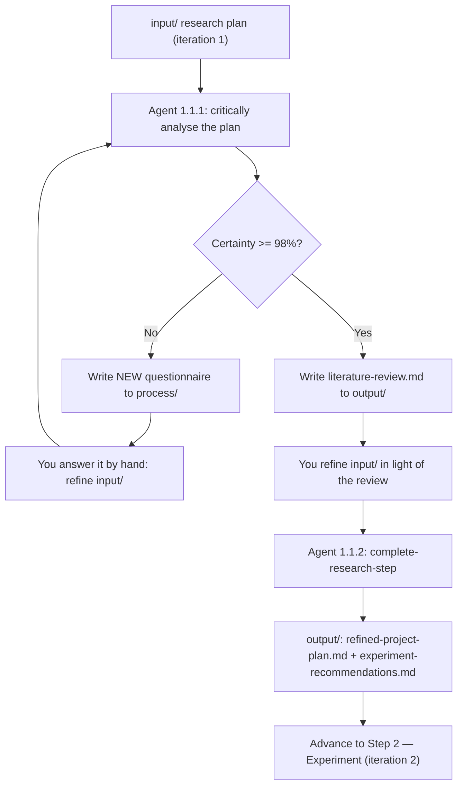

# Step 1 — Research

> Phase 1 (Research & Planning), Step 1.1. The first step in the khazad-dum pipeline.

## Purpose

You arrive at this step with a rough idea written up as a **research plan**. The Research step
pushes that idea until it is solid enough to act on. It does two things:

1. It **interrogates your plan** and either asks you hard clarifying questions or — once it is
   confident it understands the project — writes a **literature review** that gathers reliable,
   cited information relevant to what you want to build.
2. Once you have read the review and tightened your plan, it produces two **handoff artefacts** for
   the next phases: a **refined project plan** and a set of **experiment recommendations**.

Everything downstream (the experiment, the architecture, the build) inherits the quality of what
comes out of here, so the step is deliberately sceptical: a fresh agent actively hunts for
ambiguities, gaps, unstated assumptions, and feasibility risks rather than nodding along.

## Where it sits in the pipeline

```
[you write a plan]  →  STEP 1 Research  →  Step 2 Experiment  →  Step 3 Architecture  → …
   iteration 1           ─────────────       iteration 2
```

Your initial plan is **iteration 1** of an evolving project plan. Research hands the refined plan
and experiment recommendations forward as the input to Step 2.

## The `input` / `process` / `output` convention

Every Phase-1 step has its own working directory — here `documentation/01_research/` — split into
three folders. This convention repeats in steps 1–4, so it is worth learning once:

| Folder     | Owner          | Holds                                                            |
|------------|----------------|-----------------------------------------------------------------|
| `input/`   | **You**        | The current plan iteration. The agent **never** writes here.    |
| `process/` | The agent      | Working/intermediate files: questionnaires, drafts.             |
| `output/`  | The agent      | Finalised handoff artefacts for the next phase.                 |

The golden rule: **`input/` is yours.** The agent reads it but is forbidden from changing it. You
refine the plan by hand, in `input/`, between runs.

## The workflow in detail

The step runs as two sub-prompts. A fresh agent (no memory of previous runs) is used each time.

### Workflow 1.1.1 — Research Gate (Literature Review or Clarify)

This is a **looping gate**. Each run, the agent:

1. **Reads** your `input/` plan and any questionnaires already in `process/` (to see what has been
   asked before and to work out the cycle number).
2. **Critically analyses** the plan — actively looking for problems, not confirming it understands.
3. **Self-assesses a percentage certainty** that it could write a genuinely useful literature review
   without guessing.
4. **Branches:**
   - **Certainty < 98%** → it writes a *new* numbered questionnaire to
     `process/pre-literature-review-questionnaire-{N}.md` and stops. It never edits an old
     questionnaire — each cycle gets a fresh one.
   - **Certainty ≥ 98%** → it writes `output/literature-review.md` (3–4 pages). Every factual claim
     carries an Obsidian-style citation and a certainty/reliability tag with a 🟩/🟨/🟧/🟥 band, and
     the review is weighted toward what can actually be tested downstream on **AWS EC2 + a home lab
     server** (the only experiment resources available).

You re-run the gate until a fresh agent clears the bar.

### Workflow 1.1.2 — Complete Research Step

Once the literature review exists and you have refined `input/` in light of it, this sub-prompt
produces the two finalised artefacts:

- **`output/refined-project-plan.md`** — your plan synthesised with what the review established:
  tightened goal, explicit IN/OUT scope, success criteria, constraints, and the decisions still
  left open for the experiment to settle.
- **`output/experiment-recommendations.md`** — concrete things to test, each tied to a gap the
  review surfaced and mapped onto EC2 vs. home lab, concrete enough that Step 2 can turn them into a
  server config and payload.

## What you do

1. Write your initial plan into `documentation/01_research/input/` (seeded for you by
   `khazad-dum init`).
2. Run the research gate (`khazad-dum run research`, in the current CLI).
3. If a questionnaire appears in `process/`, **read it, think, and answer it by editing your plan in
   `input/`**. Then re-run the gate. Repeat.
4. When a literature review appears in `output/` instead, read it and refine `input/` once more.
5. Advance to the complete sub-prompt to produce the refined plan + experiment recommendations.

> The questionnaires are meant to be demanding — they exist to force real thinking. Treat a long
> questionnaire as the step doing its job, not as a failure.

## Artifacts in and out

| Direction | File | Notes |
|-----------|------|-------|
| In  | `input/` research plan (iteration 1) | Human-owned. |
| Out | `process/pre-literature-review-questionnaire-{N}.md` | One per gate cycle that didn't clear. |
| Out | `output/literature-review.md` | Cited, 3–4 pages, EC2/home-lab weighted. |
| Out | `output/refined-project-plan.md` | Iteration 1 → refined. |
| Out | `output/experiment-recommendations.md` | Feeds Step 2. |

## Control flow



## Tips and gotchas

- **You are in control of the plan.** The agent advises and challenges; it never silently rewrites
  your `input/`.
- **Keep experiment feasibility in mind.** Recommendations that need GPUs or managed cloud services
  are out of scope unless explicitly flagged — downstream you only have EC2 and a home lab.
- **A fresh agent each cycle** means the questionnaire and your written answers (in `input/`) are the
  only memory between runs. Answer in the plan itself, not in chat.
- The 98% bar is intentionally high; expect more than one cycle for a non-trivial project.
