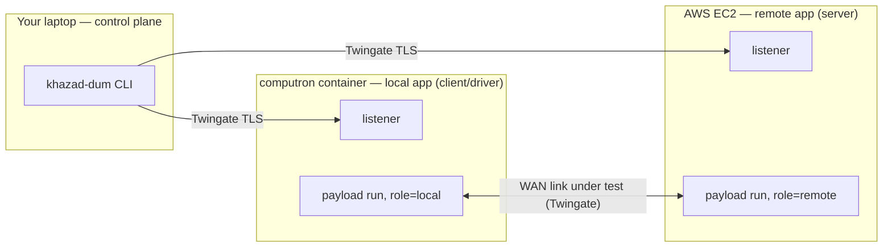
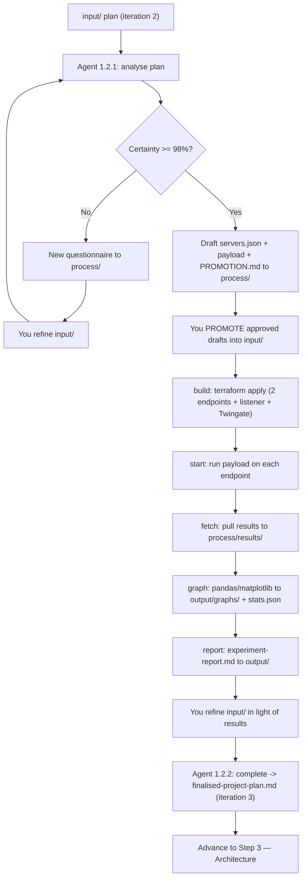

# Step 2 — Experiment

> Phase 1 (Research & Planning), Step 1.2. The empirical step: design a benchmark, run it on real
> infrastructure, and feed the measured result back into the plan.

## Purpose

Research told you what is *known*. The Experiment step settles what is *unknown* by measuring it.
For now every experiment is fixed to one question — **benchmarking communication over the WAN** —
run across a real wide-area link so you see the higher, more variable latency a LAN can't show.

The step:

1. Turns your plan into a runnable **experiment configuration** (which endpoints, which region) plus
   the **payload** code that performs the benchmark.
2. Provisions the infrastructure, runs the benchmark, collects the data, graphs it, and writes a
   report.
3. Folds the measured outcome back into a **finalised project plan (iteration 3)** that the
   Architecture phase can build on.

For the infrastructure mechanics (Terraform, Twingate, the bundle/listener model, credentials) see
[../terraform.md](../terraform.md). This doc covers the *workflow*.

## The fixed topology (a hard constraint)

You design **within** this shape — you cannot change it, only choose the protocol, metrics, region,
and load:

- A **remote app** on an **AWS EC2** host — `target: "aws"`, `role: "remote"` — the **server** side.
- A **local app** in a **Docker container on the home lab** (computron) — `target: "homelab"`,
  `role: "local"` — the **client/driver** that generates load and records measurements.
- The two reach each other over a **Twingate TLS tunnel**. That tunnel is both the WAN link under
  test (data plane) *and* the channel khazad-dum uses to drive the endpoints (control plane).

## Listener vs payload — what you author

khazad-dum installs a **fixed listener** on every endpoint automatically (a small HTTP server
exposing `/health`, `/run`, `/status`, `/results`). **You never write or manage the listener.** The
agent authors only the **payload** the listener runs: an executable `run` (plus an optional
`provision.sh`) for each endpoint, written against four environment variables the listener provides:

| Variable | Meaning |
|----------|---------|
| `KHAZAD_ROLE` | `local` or `remote` — pick the client or server behaviour. |
| `KHAZAD_PEER_ADDR` | The peer endpoint's Twingate address (host only). |
| `KHAZAD_RESULTS_DIR` | Write all results here, as machine-readable CSV/JSON. |
| `KHAZAD_RUN_ID` | The current run id. |

A run that records nothing parseable is useless — the graphing step needs columns it can plot.

## The workflow in detail

### Workflow 1.2.1 — Experiment Gate (Config or Clarify)

A **looping gate**, exactly like Research's: each cycle the agent critically analyses your plan
(protocol, metrics, server behaviour, client load, result format), self-assesses certainty, and
branches:

- **< 98%** → writes a new `process/pre-experiment-questionnaire-{N}.md` and stops.
- **≥ 98%** → drafts the experiment into `process/`:
  - `process/servers.json` — exactly two endpoints (one `aws`/`remote`, one `homelab`/`local`).
  - `process/payload/<name>/` — the `run` (and optional `provision.sh`) for each endpoint.
  - `process/PROMOTION.md` — a checklist telling you exactly what to copy into `input/`.

Crucially, the gate writes **drafts to `process/` only**. Nothing runs until **you promote** the
approved files into `input/` (the `build` command reads `input/`, never `process/`).

### The infra pipeline: build → start → fetch → graph → report

After you promote the config and payload into `input/`, five fixed CLI stages run the experiment:

| Stage | Command | What happens |
|-------|---------|--------------|
| build | `khazad-dum build experiment` | Terraform provisions both endpoints + listener + Twingate. |
| start | `khazad-dum start experiment` | Triggers each endpoint's payload `run` (injecting peer address). |
| fetch | `khazad-dum fetch experiment` | Pulls all results back to `process/results/`. |
| graph | `khazad-dum graph experiment` | A WRITE-mode agent runs pandas/matplotlib → `output/graphs/` + `stats.json`. |
| report | `khazad-dum report experiment` | A WRITE-mode agent interprets the data → `output/experiment-report.md`. |

> The trigger verb is **`start`** (not `run`) because `run` is already taken by `khazad-dum run <step>`.

When you're done, tear the infra down with `khazad-dum destroy experiment`.

### Workflow 1.2.2 — Complete Experiment Step

After the report exists and you've refined `input/` in light of the results, this sub-prompt writes
**`output/finalised-project-plan.md` (iteration 3)**: your plan synthesised with what the experiment
actually demonstrated about WAN communication — decisions resolved, scope/criteria updated, and any
question left for Architecture flagged. This is the direct input to Step 3.

## What you do

1. Run the gate; answer questionnaires by refining `input/` until it drafts a config + payload.
2. Read `process/PROMOTION.md` and **copy the approved `servers.json` + `payload/` into `input/`**
   (keep `run` executable).
3. `build` → `start` → `fetch` → `graph` → `report`.
4. Read `output/experiment-report.md`; refine `input/`.
5. Run the complete sub-prompt → finalised plan (iteration 3). `destroy` the infra.

## Artifacts in and out

| Direction | File | Notes |
|-----------|------|-------|
| In  | `input/` plan (iteration 2) | From Research. |
| Out (draft) | `process/servers.json`, `process/payload/<name>/`, `process/PROMOTION.md` | You promote to `input/`. |
| In (promoted) | `input/servers.json`, `input/payload/<name>/` | What `build` consumes. |
| Out | `process/results/<endpoint>/` | Raw fetched data. |
| Out | `output/graphs/*.png`, `output/graphs/stats.json` | From `graph`. |
| Out | `output/experiment-report.md` | From `report`. |
| Out | `output/finalised-project-plan.md` | Iteration 3 → Step 3. |

## Control flow

## Tips and gotchas

- **Promotion is a deliberate human gate.** The gate cannot touch `input/`; nothing is provisioned
  until you copy drafts across. Review the payload before promoting.
- **Pick a region for a realistic WAN distance** — the point is to stress a real wide-area link.
- **Live-tweak risk:** homelab Twingate addressing and home→AWS app routing depend on the live
  tenant and may need a hands-on adjustment on the first real run (see terraform.md).
- **Keep the two payloads consistent:** the client must connect to the same app port the server
  listens on.
- Remember to `destroy` when finished so you aren't paying for idle EC2.
