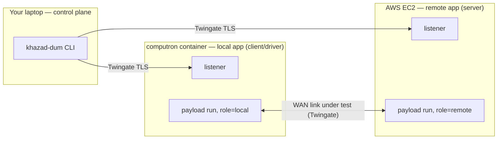
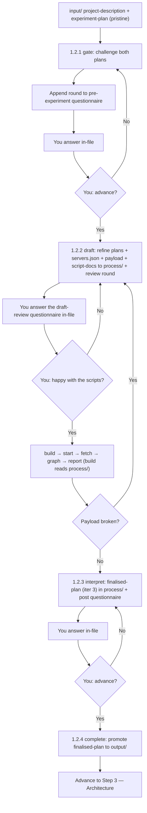

# Step 2 — Experiment

> Phase 1 (Research & Planning), Step 1.2. The empirical step: design a benchmark, run it on real
> infrastructure, and feed the measured result back into the plan.

## Purpose

Research told you what is *known*. The Experiment step settles what is *unknown* by measuring it. For now
every experiment is fixed to one question — **benchmarking communication over the WAN** — run across a
real wide-area link so you see the higher, more variable latency a LAN can't show.

The step turns two plans into a runnable benchmark, provisions the infrastructure, runs it, collects and
graphs the data, writes a report, then folds the measured outcome into a **finalised project plan
(iteration 3)** for the Architecture phase.

For the infrastructure mechanics (Terraform, Twingate, the listener model, credentials) see
[../terraform.md](../terraform.md). This doc covers the *workflow*.

## Two inputs, kept pristine

Step 2's `input/` holds **two human-owned docs**, both seeded by `khazad-dum init`:

| File | What it is |
|------|------------|
| `project-description.md` | The project this experiment serves (promote Research's `refined-project-plan.md`, iteration 1, into here). |
| `experiment-plan.md` | The specific experiment design — protocol/metrics, load, success criteria. |

As in Research, **`input/` stays pristine**: you don't hand-edit it. You answer the agent's questions
**in the questionnaires** (in `process/`), and the agent folds your answers into refined copies under
`process/`. The two gates challenge *both* docs.

These two docs are the **only** things in `input/`. The agent writes the config, payload, results, and
everything else to `process/`, and `build` reads them from there — you never copy files between folders.

## The fixed topology (a hard constraint)

You design **within** this shape — you choose the protocol, metrics, region, and load, not the shape:

- A **remote app** on an **AWS EC2** host — `role: remote` — the **server** side.
- A **local app** in a **Docker container on the home lab** (computron) — `role: local` — the
  **client/driver** that generates load and records measurements.
- They reach each other over a **Twingate TLS tunnel** — the WAN link under test *and* the channel
  khazad-dum uses to drive the endpoints.

## Listener vs payload — what you author

khazad-dum installs a **fixed listener** on every endpoint automatically (a small HTTP server). **You
never write the listener.** The agent (in `draft-experiment`) authors only the **payload** the listener
runs: an executable `run` (plus an optional `provision.sh`) per endpoint, against four environment
variables:

| Variable | Meaning |
|----------|---------|
| `KHAZAD_ROLE` | `local` or `remote` — pick the client or server behaviour. |
| `KHAZAD_PEER_ADDR` | The peer endpoint's Twingate address (host only). |
| `KHAZAD_RESULTS_DIR` | Write all results here, as machine-readable CSV/JSON. |
| `KHAZAD_RUN_ID` | The current run id. |

**The payload contract** (the agent must honour it; check it before promoting):
- **The server self-terminates** — time-boxed, or stopped by an end-signal from the client. A server
  that runs forever can't have its results fetched and would otherwise stall the run.
- **The client tolerates a cold server** — both sides start at once, so it retries the connection.
- **Both sides share one app port**, and write parseable results the graphing step can plot.

## The workflow in detail

Four sub-prompts wrap the pipeline. Each gate **loops** and reports a `Certainty · Recommendation`;
**you make the advance call** — there is no automatic threshold.

### Workflow 1.2.1 — Experiment Gate (Clarify Plan & Experiment)

A looping pre-experiment gate. Each cycle the agent attacks **both** input docs (protocol, metrics,
server/client behaviour, result shape) and appends a `## Round {N}` of hard questions to
`process/pre-experiment-questionnaire.md`. **Questions only** — nothing is designed yet. You answer
in-file and advance when ready.

### Workflow 1.2.2 — Draft Experiment (Config & Payload)

A looping draft step. Each cycle the agent folds your answers into refined plans in `process/`, drafts the
experiment into `process/`, and appends a **review** round you answer:

- `servers.json` — exactly two endpoints (one `aws`/`remote`, one `homelab`/`local`).
- `payload/<name>/` — the `run` (+ optional `provision.sh`) for each endpoint, plus a `<name>.md`
  documenting what the script does (its behaviour, port, result columns).
- `draft-review-questionnaire.md` — a `## Round {N}` where the agent reports its confidence and asks you
  to **confirm or correct the scripts** — the load, the metrics, the result columns.

You won't hand-edit the scripts. Instead you **read the `<name>.md` docs and answer the review
questionnaire in plain language** ("send 1000 requests, not 100"; "also record connect time"), and the
agent rewrites the scripts next run. When you're happy you run the pipeline — there is **no promotion
step**: `build` reads the config + payload straight from `process/`.

### The infra pipeline: build → start → fetch → graph → report

| Stage | Command | What happens |
|-------|---------|--------------|
| build | `khazad-dum build experiment` | Reads `process/servers.json` + `process/payload/`; Terraform provisions both endpoints + listener + Twingate. |
| start | `khazad-dum start experiment` | Triggers each payload `run`; waits for the **client** side to finish (the server is not waited on). |
| fetch | `khazad-dum fetch experiment` | Pulls results back to `process/results/`. |
| graph | `khazad-dum graph experiment` | A WRITE-mode agent runs pandas/matplotlib → `output/graphs/` + `stats.json`. |
| report | `khazad-dum report experiment` | A WRITE-mode agent writes `output/experiment-report.md` — with a mermaid topology diagram and the script-docs appended as appendices. |

> The trigger verb is **`start`** (not `run`) because `run` is taken by `khazad-dum run <step>`.

**If a payload is broken** (the report or a `run.log` shows a failure), re-run **`draft-experiment`** — it
reads `process/results/<endpoint>/run.log` and fixes the payload draft. Re-run the pipeline. When
finished, `khazad-dum destroy experiment`.

### Workflow 1.2.3 — Interpret Results & Refine Plan

A looping post-experiment gate. Each cycle the agent writes/refines `process/finalised-project-plan.md`
(**iteration 3**) — the plan synthesised with what the experiment demonstrated — and appends a
`## Round {N}` to `process/post-experiment-questionnaire.md` challenging what the results mean for the
project. You answer in-file and advance.

### Workflow 1.2.4 — Complete Experiment Step

A final QC pass that **promotes** `finalised-project-plan.md` from `process/` to `output/`. This is the
direct input to Step 3.

## What you do

1. Promote Research's outputs into `input/project-description.md`; fill `input/experiment-plan.md`.
2. Run the gate; answer questionnaires in-file until you advance.
3. Run draft; read the script-docs, answer the **draft-review questionnaire** to correct the scripts, and
   re-run until happy.
4. `build → start → fetch → graph → report` (build reads `process/`). If a payload fails, re-run
   `draft-experiment` to fix it, then re-run the pipeline.
5. Read `output/experiment-report.md`; run the interpret gate, answering in-file.
6. Complete → finalised plan (iteration 3) in `output/`. `destroy` the infra.

## Artifacts in and out

| Direction | File | Notes |
|-----------|------|-------|
| In (pristine) | `input/{project-description,experiment-plan}.md` | The only files in `input/`; never edited mid-step. |
| Work | `process/{pre-experiment,draft-review,post-experiment}-questionnaire.md` | One file each; a round appended per cycle. |
| Work | `process/{project-description,experiment-plan}.md` | Refined iterations (iter 2). |
| Work | `process/servers.json`, `process/payload/<name>/` | Drafted by the agent; `build` reads them here (no promotion). |
| Out | `process/results/<endpoint>/` | Raw fetched data (incl. `run.log`). |
| Out | `output/graphs/*.png`, `stats.json` | From `graph`. |
| Out | `output/experiment-report.md` | From `report` (mermaid + appendices). |
| Out | `output/finalised-project-plan.md` | Iteration 3 → Step 3. |

## Control flow

## Tips and gotchas

- **You don't edit scripts or copy files.** The agent owns `servers.json` + the payload (in `process/`);
  you steer them by answering the **draft-review questionnaire**, and `build` reads them from `process/`.
  Nothing is provisioned until you run `build`, so review the script-docs first.
- **`input/` stays pristine.** Answer in the questionnaires, not by hand-editing the two plan docs.
- **Pick a region for a realistic WAN distance** — the point is to stress a real wide-area link.
- **The server must self-terminate** and the client must retry a cold server — check this in the drafted
  payload before promoting; it's the most common cause of a stalled or empty run.
- **Live-tweak risk:** homelab Twingate addressing and home→AWS routing depend on the live tenant and may
  need a hands-on adjustment on the first real run (see terraform.md).
- Remember to `destroy` when finished so you aren't paying for idle EC2.
