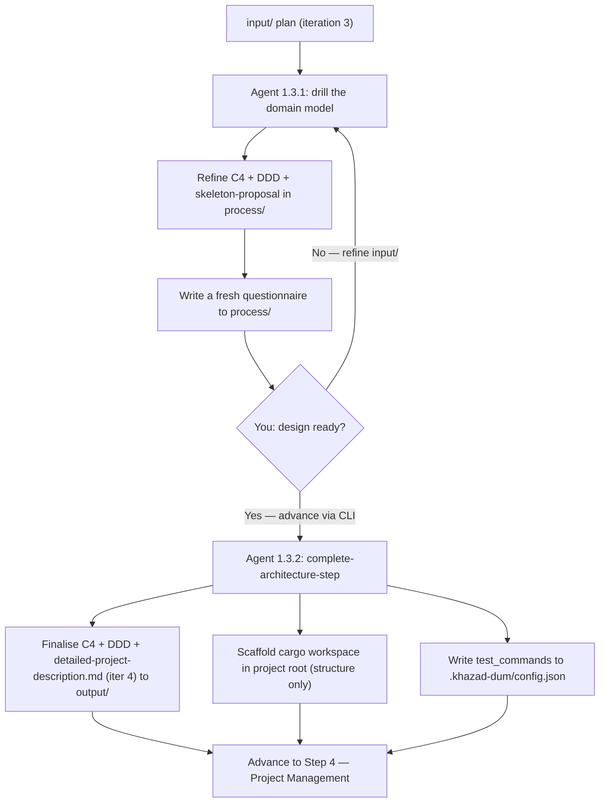

# Step 3 — Architecture

> Phase 1 (Research & Planning), Step 1.3. Where the project stops being a plan and gets a shape: a
> domain model, a high-level technical architecture, and a scaffolded codebase.

## Purpose

By now you have a finalised plan grounded in research and experiment. The Architecture step turns
that into the documentation that **accurately defines and describes the application to be built**,
and then **scaffolds the real project skeleton** so later phases have a codebase to fill in. It
produces three design artefacts and one real cargo workspace:

- a **C4 diagram** (system context + containers),
- a **DDD table** (ubiquitous language, DDD building blocks, and the all-important
  **architectural-layers table**),
- a **detailed project description** (iteration 4), and
- a **skeleton cargo workspace** in your project root — structure only, no logic.

The default stack is **Rust / a cargo workspace** unless the plan clearly demands otherwise.

## Where it sits in the pipeline

```
Step 2 Experiment → STEP 3 Architecture → Step 4 Project Management → Phase 2 (Build)
   iteration 3        ──────────────────     iteration 4
```

The architectural-layers table it defines is the grid that Step 4 cuts **vertical slices** against,
so getting those layers crisp is the most consequential output of this step.

## What makes this step different

Architecture **breaks the gate pattern**. There is **no certainty branch** — the agent never decides
"I'm sure enough" and produces a final deliverable on its own. Instead, on **every** cycle it does
**both**:

1. **refines the design artefacts** (C4, DDD, skeleton proposal) in `process/`, and
2. **produces a fresh questionnaire** to drive the next round of your input.

The loop simply repeats — refine, ask, you answer, refine, ask — until **you decide via the CLI**
that the design is ready and trigger the Complete step. The agent never auto-advances.

## The workflow in detail

### Workflow 1.3.1 — Domain Modelling Loop

Each cycle the agent drills into the domain across four fronts — **ubiquitous language**,
**high-level technical architecture**, **domain-driven design** (bounded contexts, aggregates,
entities, value objects, events, invariants), and the **layered architecture** — then writes/refines
three files in `process/` and emits a questionnaire:

| File (`process/`) | What it is |
|-------------------|------------|
| `c4-diagram.md` | Mermaid `C4Context` + `C4Container` views of the system. |
| `ddd-table.md` | Ubiquitous language + DDD building blocks **+ the architectural-layers table**. |
| `skeleton-proposal.md` | Proposed cargo workspace layout (crates/dirs/modules) + predetermined test commands. |
| `domain-modelling-questionnaire-{N}.md` | A fresh set of hard questions every cycle (including cycle 1). |

The skeleton proposal is a **proposal only** at this stage — no files are created outside
`documentation/` during the loop.

### Workflow 1.3.2 — Complete Architecture Step

Triggered **when you decide the design is ready**. This is the one Phase-1 step that writes *outside*
`documentation/`. It:

1. **Finalises** `output/c4-diagram.md` and `output/ddd-table.md` (cleaned up for handoff, not just
   copied), making sure the layers table is complete and unambiguous.
2. Writes **`output/detailed-project-description.md` (iteration 4)** — the most concrete description
   yet, folding in the ubiquitous language, the C4 architecture, and the DDD model.
3. **Scaffolds the skeleton** in your project root per the approved proposal: `cargo` workspace +
   member crates, the module/directory layout, and the testing scaffolding — **structure only**
   (`todo!()` / stub bodies, no business logic).
4. Records the **test commands** under a `test_commands` key in `.khazad-dum/config.json` (merging,
   not clobbering) so later phases can run the real gate.

## What you do

1. Run the loop. Read the questionnaire and the evolving C4/DDD/skeleton proposal each cycle.
2. Answer by refining `input/` by hand; re-run the loop.
3. When the C4 diagram, DDD table (especially the layers), and proposed skeleton all look right,
   **advance via the CLI** to the Complete step.
4. Confirm the scaffolded workspace compiles and that `test_commands` landed in
   `.khazad-dum/config.json`.

## Artifacts in and out

| Direction | File | Notes |
|-----------|------|-------|
| In  | `input/` finalised plan (iteration 3) | From Experiment. |
| Out (loop) | `process/{c4-diagram,ddd-table,skeleton-proposal}.md` | Refined every cycle. |
| Out (loop) | `process/domain-modelling-questionnaire-{N}.md` | One per cycle. |
| Out | `output/c4-diagram.md`, `output/ddd-table.md` | Finalised. |
| Out | `output/detailed-project-description.md` | Iteration 4 → Step 4. |
| Out | cargo workspace in `$CWD` root | Structure only. |
| Out | `.khazad-dum/config.json` `test_commands` | Used by later phases. |

## Control flow



## Tips and gotchas

- **The layers table is the keystone.** Step 4 slices vertically across it; if a layer's
  responsibility is fuzzy, slicing will be too. Spend cycles here.
- **No auto-advance** — you must explicitly trigger Complete. The loop will happily keep refining and
  asking forever otherwise.
- **The skeleton is structure, not behaviour.** Expect `todo!()` bodies and empty test files; that's
  correct, not unfinished.
- `test_commands` is written by merge — if the config already holds other keys, they survive.
