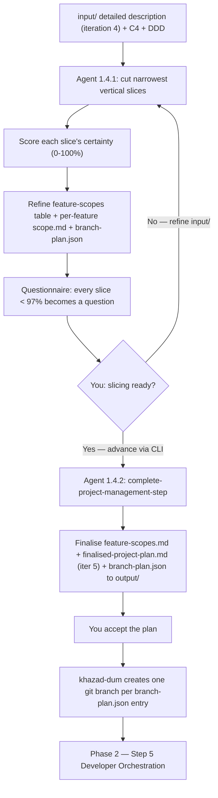

# Step 4 — Project Management

> Phase 1 (Research & Planning), Step 1.4. The last planning step and the **bridge into the real
> project**: it breaks the architecture into buildable, testable feature slices.

## Purpose

Architecture described the whole system. Project Management cuts it into the **narrowest possible
vertical slices** — each slice **one feature delivered end-to-end**, from the top layer down to the
bottom — and writes a self-contained `scope.md` for each. Those `scope.md` files are the **unit of
work for the build phase**: Step 5 builds one slice at a time, using only its scope doc as context.

It also produces a **branch plan** — a machine-readable list of one branch per slice — which
khazad-dum uses to create the git branches when you accept the plan.

This is where the project leaves the `input`/`process`/`output` planning model behind: the
per-feature scope docs live at **top-level** `documentation/features/<feat>/scope.md`, outside the
step's own directory, because they belong to the real project, not to this phase.

## Where it sits in the pipeline

```
Step 3 Architecture → STEP 4 Project Management → Phase 2: Step 5 Developer Orchestration
   iteration 4          ───────────────────────     (builds each feature slice)
                        iteration 5
```

## What makes this step different

Like Architecture, PM **breaks the gate pattern** — no global certainty branch. Every cycle it does
**both**: refine the slice artefacts AND emit a fresh questionnaire. The difference is that certainty
is judged **per slice**: for each slice the agent rates its confidence (0–100%) that it understands
that slice's end-to-end requirements and its impact on existing code; **any slice below 97%** becomes
a question in this cycle's questionnaire. You advance via the CLI when you're satisfied.

## The workflow in detail

### Workflow 1.4.1 — Vertical Slicing Loop

Each cycle the agent takes the **architectural-layers table** (from Architecture) and cuts the system
into thin end-to-end slices, preferring **many small slices over a few large ones**. For each slice
it confirms the end-to-end requirements and acceptance criteria, maps dependencies and
**parallel-safety** (which branches could be worked at once without conflict), and **classifies it
against existing code**:

- `new-only` — brand-new code,
- `extends-existing` — adds methods/variants/impls without changing existing types,
- `requires-enabling-refactor` — existing code must first be **behaviour-preservingly** reshaped.

A slice that would have to **change existing behaviour** (not just structure) is flagged **human-led**,
because the build phase only does behaviour-preserving refactoring.

It writes/refines, every cycle:

| Artefact | Location | What it is |
|----------|----------|------------|
| Ordered feature-scopes table | `process/feature-scopes.md` | One row per slice: slice → branch → scope path → parallel-safe → **% certainty**. Ordered by build order. |
| Per-feature scope docs | `documentation/features/<feat>/scope.md` | One per slice — the build-phase contract (see below). |
| Proposed branch plan | `process/branch-plan.json` | One branch per slice, ordered, with `depends_on`. A proposal — **no git is run**. |
| Questionnaire | `process/vertical-slicing-questionnaire-{N}.md` | Every sub-97% slice becomes a question. |

**The `scope.md` contract** — each captures enough that the slice can be built and verified from that
one file alone: *Summary · End-to-End Behaviour (per layer) · Acceptance Criteria · Contracts & Data ·
Dependencies · Out of Scope · Existing Code & Refactoring*.

### Workflow 1.4.2 — Complete Project Management Step

Triggered when **you decide the slicing is ready**. It finalises:

- `output/feature-scopes.md` — the clean ordered table.
- `output/finalised-project-plan.md` **(iteration 5)** — goal, scope, **build order**,
  **parallel-safe groupings**, how the slices add up to the whole, and anything the build phase must
  still resolve. The direct input to Phase 2.
- `output/branch-plan.json` — the accepted branch plan, internally consistent (ordering matches the
  table, every `scope_path` exists, every `depends_on` resolves).

It also makes sure each `documentation/features/<feat>/scope.md` is complete and self-contained. It
**never runs git** — khazad-dum creates one branch per `branch-plan.json` entry once you accept.

## What you do

1. Run the loop. Each cycle, read the feature-scopes table, the per-feature scope docs, and the
   questionnaire.
2. Answer the per-slice questions by refining `input/`; re-run.
3. When every slice is well understood and the slicing looks right, **advance via the CLI** to
   Complete.
4. Accept the plan → khazad-dum creates the branches → Phase 2 can begin.

## Artifacts in and out

| Direction | File | Notes |
|-----------|------|-------|
| In  | `input/` detailed description (iteration 4) + C4 + DDD (layers table) + scaffolded skeleton | From Architecture. |
| Out (loop) | `process/feature-scopes.md`, `process/branch-plan.json` | Refined each cycle. |
| Out (loop) | `documentation/features/<feat>/scope.md` | One per slice; **top-level**. |
| Out (loop) | `process/vertical-slicing-questionnaire-{N}.md` | One per cycle. |
| Out | `output/feature-scopes.md`, `output/finalised-project-plan.md`, `output/branch-plan.json` | Finalised. |

## Control flow



## Tips and gotchas

- **Slice as narrowly as you can.** Narrow slices are easier for the TDD pipeline to build, test, and
  parallelise. If a slice can be split without breaking end-to-end coherence, split it.
- **The scope.md is the whole contract.** In Phase 2 the build agents see *only* the slice's
  `scope.md` — not the wider codebase. Anything they need must be in it, especially the *Existing Code
  & Refactoring* section.
- **Behaviour changes are routed to humans.** The build phase only does behaviour-preserving
  refactoring; isolate and flag any slice that must change existing behaviour.
- **Branch creation is a CLI action, not the agent's.** The prompt only emits `branch-plan.json`.
