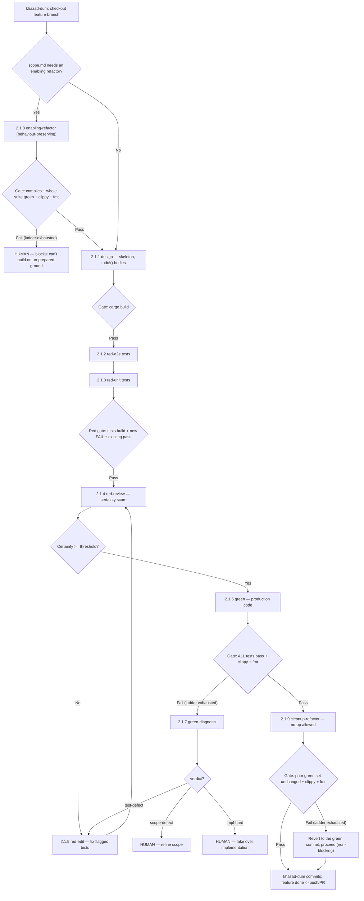
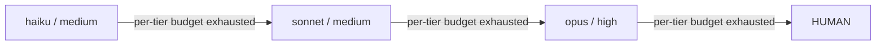

# Step 5 — Developer Orchestration

> Phase 2 (Active Build), Step 2.1. The build engine: a deterministic **Test-Driven-Development
> pipeline** that turns each feature's `scope.md` into working, tested Rust — one feature at a time.

## Purpose

Project Management produced a `scope.md` per feature slice and a branch for each. Developer
Orchestration builds them. It is **not** a questionnaire/loop planning phase — it is a deterministic
**state machine** that drives a feature through the classic TDD beats (red → green → refactor) with
extra review and diagnosis steps, escalating to stronger models and ultimately to a human when it
gets stuck.

## The core principle: agents write, khazad-dum decides

This is what makes the phase deterministic and trustworthy:

- **Agents** do the creative work — write code and a single **status report** — and nothing else.
- **khazad-dum** is the deterministic part. After every agent run it executes the project's
  configured `test_commands` (from `.khazad-dum/config.json`) as the **real gate**, **owns all git**,
  and decides every transition and escalation.

An agent's self-reported "the tests pass" is **never** trusted; only khazad-dum running the real
commands counts. And each agent's **complete context is the feature's `scope.md`** — agents are
forbidden from trawling or auditing the wider codebase beyond the modules the scope names.

## Where it sits in the pipeline

```
Step 4 Project Management → STEP 5 Developer Orchestration → Step 6 Delivery & Maintenance
   (scope.md + branches)      ─────────────────────────────
```

It shares the Phase-2 global prompt `workflows/active-build-phase.md` with Step 6 (tier-agnostic
rules, no git for agents, scope.md is the complete context).

## The nine phases

Each phase is one prompt, titled `Workflow 2.1.x`. The numbering is just a **stable id**, so the
phases are *not* run in numeric order — here they are in **execution** order:

| # | Phase | When | Does | khazad-dum's gate |
|---|-------|------|------|-------------------|
| 1 | **2.1.8 enabling-refactor** | *optional*, first — only if scope's *Existing Code & Refactoring* asks | Behaviour-preservingly reshape existing code so the feature fits. No tests, no feature code. | compiles + **whole** existing suite still green + clippy + fmt |
| 2 | **2.1.1 design** | always | Skeleton: modules/types/sigs with `todo!()` bodies. May add new types or methods/variants on existing types; never changes existing behaviour/sigs. | `cargo build` compiles |
| 3 | **2.1.2 red-e2e** | always | End-to-end/integration tests in the `e2e_tests` crate, from scope's acceptance criteria. | tests build + new tests **fail** + existing pass |
| 4 | **2.1.3 red-unit** | always | Co-located `#[cfg(test)]` unit tests. | same red gate |
| 5 | **2.1.4 red-review** | always | **Review only**: score *certainty* the tests capture the scope; list deficiencies. | certainty ≥ threshold → green; else → red-edit |
| 6 | **2.1.5 red-edit** | when review fails | Fix only the flagged tests, stay red → back to 2.1.4. | red gate (bounded loop) |
| 7 | **2.1.6 green** | always | Production code to pass **all** tests. Never edits tests. | all tests pass + clippy + fmt |
| 8 | **2.1.9 cleanup-refactor** | after green passes | TDD third beat: tidy this feature's code, behaviour-preservingly. A no-op is valid. | prior green set unchanged + clippy + fmt |
| 9 | **2.1.7 green-diagnosis** | only when green exhausts the ladder | Diagnose *why* and emit a verdict. | verdict routes the next step |

Phases are **tier-agnostic**: a prompt never names a model or effort level — khazad-dum sets
`--model`/`--effort` via the escalation ladder.

## The pipeline



(The `test-defect` kick-back to red-edit is allowed **once**; if green still fails after it, a human
takes over.)

## Gates and escalation

After each agent run khazad-dum runs the real gate. On a **fail** it doesn't give up immediately: it
**retries at the same tier** up to a per-tier budget, then **climbs a ladder** of stronger models,
and only escalates to a human at the top:



All thresholds, retry budgets, the review-loop guard, and the tier ladder live in
`.khazad-dum/config.json` — **never** in the prompts.

## Two rules worth internalising

**Refactoring is behaviour-preserving only (for now).** Both refactor phases change the *structure*
of code, never what it does — no test is changed, weakened, or deleted, and externally observable
behaviour stays identical. A slice that must *change* existing behaviour is routed to a human (PM
already flags these). This keeps the red gate's "existing tests still pass" invariant intact.

**Refactor failure is asymmetric:**

- **enabling-refactor** fails (after escalation) → **human, blocking.** The feature can't be built on
  un-prepared ground, so the pipeline stops.
- **cleanup-refactor** fails (after escalation) → **revert to the green commit and proceed,
  non-blocking.** Polish must never sink a feature that already passed green.

## Git, reports, and logs

- **Git is khazad-dum's alone.** It checks out the feature branch, commits at each passed gate with a
  structured message, and pushes/PRs at the end. **Agents never run git.**
- Every phase finishes by writing **one report** to
  `.khazad-dum/orchestration_log/<feature>/<workflow-id>-<slug>-{N}.md` (`{N}` = attempt/cycle).
  Three templates, each a machine-readable ```json``` block (the routing signal) plus a prose audit:
  - `status-report` — all phases (including both refactors),
  - `review-report` — 2.1.4 red-review (its `certainty` + `deficiencies` drive routing),
  - `diagnosis-report` — 2.1.7 green-diagnosis (its `verdict` drives routing).

## What you do

Most of this phase runs without you. You step in only when khazad-dum escalates to a human:

- an **enabling-refactor blocker** (the prepared-ground couldn't be made behaviour-preservingly),
- a **scope-defect** verdict (the scope is ambiguous/contradictory — refine the `scope.md`),
- an **impl-hard** verdict (the implementation is beyond the automated attempts — take it over), or
- a green that still fails after the single `test-defect` kick-back.

Read the relevant report in `.khazad-dum/orchestration_log/<feature>/` to see exactly where it
stopped and why.

## Tips and gotchas

- **Trust the real gate, not the agent's word.** The whole design exists because a self-reported
  pass is unreliable; khazad-dum re-runs the commands every time.
- **A no-op cleanup-refactor is success**, not a failure — don't expect churn.
- **scope.md quality determines everything here.** If the pipeline keeps failing review or
  diagnosing `scope-defect`, the fix is upstream in Step 4, not in the prompts.
- **The numbering is non-linear by design** — `2.1.8`/`2.1.9` (refactors) and `2.1.7` (diagnosis) are
  stable ids, run out of numeric order. Always read them in execution order.
