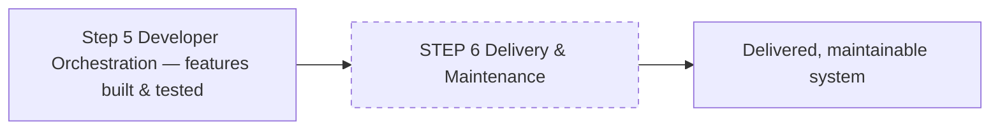

# Step 6 — Delivery and Maintenance

> Phase 2 (Active Build), Step 2.2. The final step: deliver the built system and keep it running.

## Status — not yet authored

This step is **not implemented**. Its prompt (`workflows/06_delivery_and_maintenance/prompts/prompt.md`)
and template (`templates/template.md`) are empty placeholders, and its **deliverables are still
undefined** — they need a design conversation with the project owner (James) before the prompts can
be written. This document describes what is *known* about its intended place in the pipeline; it will
be expanded once the step is designed.

## Where it sits in the pipeline

It runs **after** Developer Orchestration has built the feature slices, so by the time it starts the
real project exists, is on its feature branches, and has passed its test gates.

## Intended shape (provisional)

- It is part of **Phase 2 (Active Build)**, so it inherits the global prompt
  `workflows/active-build-phase.md`: non-interactive, **agents never run git** (khazad-dum owns
  version control), the feature/scope is the complete context, and prompts stay **tier-agnostic**
  (no model/effort named — khazad-dum controls those).
- Current intent is a **single prompt** (not a looping/gate phase like Phase 1), mirroring how the
  other Phase-2 work is structured around concrete actions rather than questionnaire cycles.

## Open questions to resolve before authoring

- **What are the deliverables?** Packaging, release artefacts, deployment, documentation,
  monitoring/maintenance runbooks — the scope is undecided.
- **What does "done" look like** for a delivered khazad-dum-built project, and what gate (if any)
  does khazad-dum run to verify it?
- **Does it operate per-feature or per-project?** (Step 5 is per-feature; delivery may be whole-project.)

See [.claude/docs/roadmap.md](../../.claude/docs/roadmap.md) for the current project state and the
"author the step 06 prompts/templates" item.

## Tips

- Until this step is authored, the pipeline effectively ends at Step 5 (Developer Orchestration).
- Don't treat the empty `prompts/prompt.md` / `templates/template.md` as bugs — they are intentional
  placeholders awaiting design.
