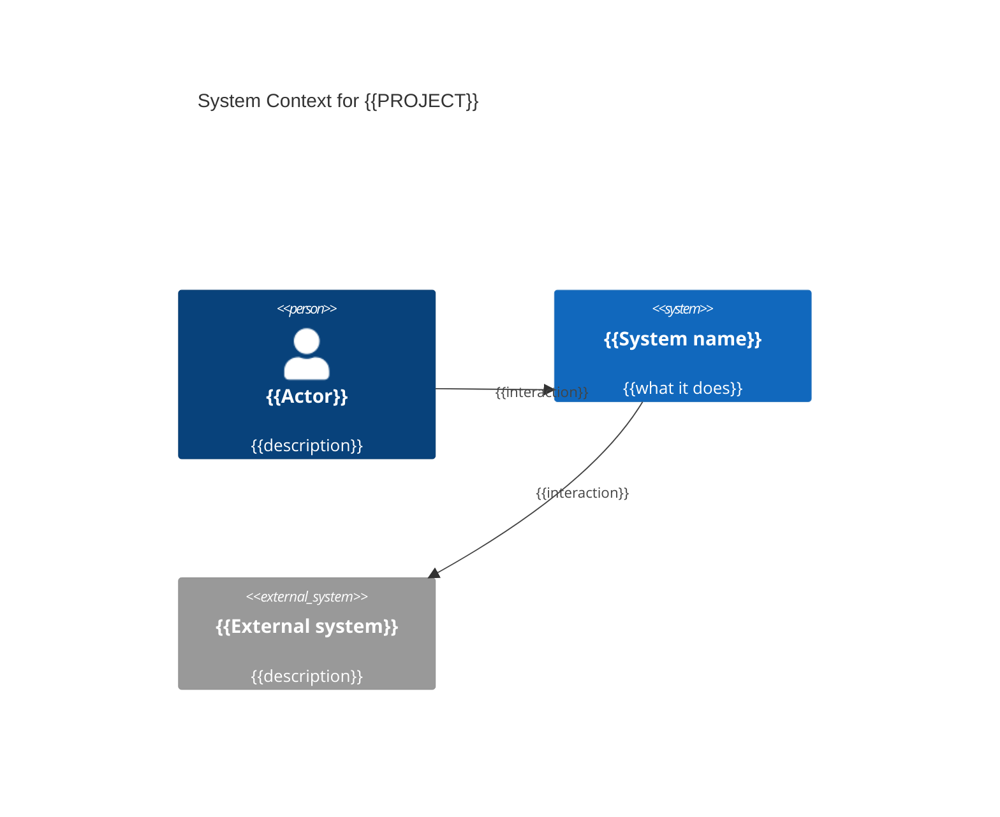
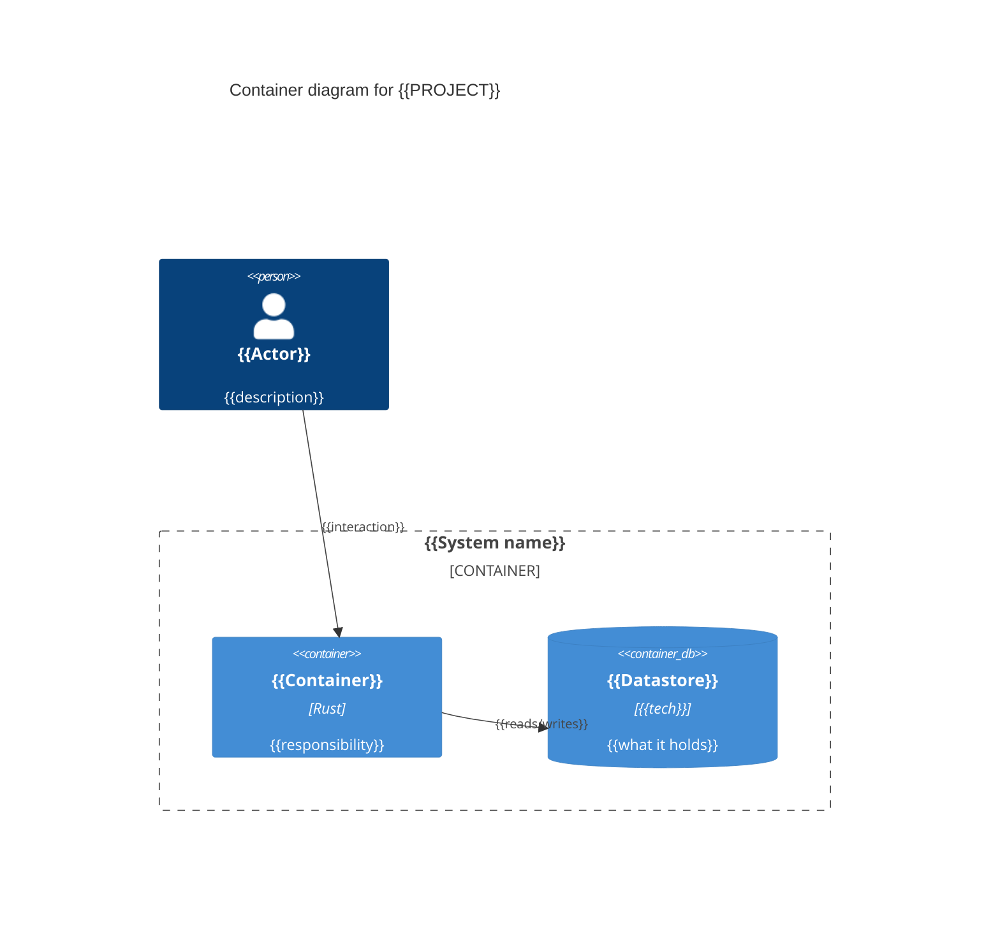

# C4 Architecture — {{PROJECT}}

## Level 1 — System Context

## Level 2 — Containers

## Architectural Notes
<!-- Key boundaries, data flow, and decisions that the diagrams don't fully capture. -->
- {{note}}
